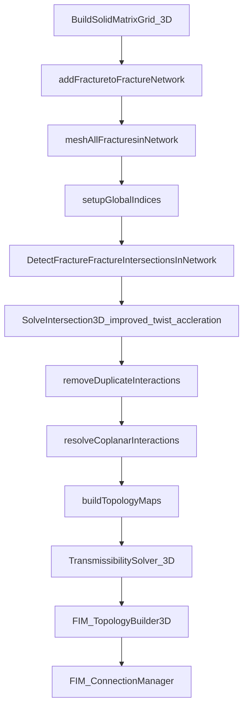

# PROJECT_CONTEXT

## 0. Metadata

| Item | Value |
|---|---|
| Last Updated | 2026-03-10 (Asia/Shanghai, Day6 static implementation aligned: dispatcher/cases/log-guards/VTK pipeline + plan-consistency fixes) |
| Git Branch | `main` |
| Git Commit | `dirty working tree (2026-03-10, Day6 static deviations fixed; dynamic gates pending manual run)` |
| Owner / Maintainer | Yongwei (请按实际维护人更新) |
| Project Root | `2D-Unstr-Quadrilateral-EDFM` |
| Current Entry Mode | `main.cpp` 已支持参数化 dispatcher（`--case=...` / `--list` / `--help`） |

---

## 1. 项目目标与论文章节映射

### 1.1 章节一（已实现）

**非结构化网格嵌入式离散裂缝模型的快速生成与耦合技术**

- 2D：2D 基岩 + 1D 裂缝（DFN），已实现 AABB/网格索引/8DOP/DDA 等候选筛选与精确求交流程。
- 3D：3D 基岩 + 2D 裂缝独立网格，已实现八叉树、14-DOP、光栅化等加速候选筛选与交互多边形重构。
- 已形成可导出、可诊断的 NNC 几何数据（交互面积、法向、距离、拓扑映射）。

对应代码主干：

- 2D 几何/拓扑：`MeshManager.h`, `mesh.h`, `FractureNetwork.h`, `2D_EDFM_test.h`, `2D_EDFM_MeshTest_Benchmark.h`
- 3D 几何/拓扑：`3D_MeshManager.h`, `EDFM_Geometry_3D.h`, `FaceIndexedOctree.h`, `3D_Improved_EDFM_test.h`, `3D_EDFM_MeshTest_Benchmark.h`

### 1.2 章节二（在研，基础框架已具备）

**裂缝性储层超临界 CO2 单相热-流耦合数值模型**

- 已具备：场管理、变量初始化、物性管理、边界条件统一管理、静态传导率（Matrix/FI/NNC/FF）模块。
- 在研重点：把静态几何传导率 + 动态物性/状态方程 + 时间推进/非线性求解完整闭环化。

对应代码主干：

- 场管理：`2D_FieldManager.h`, `3D_FieldManager.h`
- 初始化：`2D_VariableInitializer.h`, `3D_VariableInitializer.h`
- 物性：`2D_PhysicalPropertiesManager.h`, `3D_PhysicalPropertiesManager.h`, `CO2PropertyTable.*`, `WaterPropertyTable.*`
- 静态传导率：`TransmissibilitySolver_2D.*`, `TransmissibilitySolver_3D.*`

### 1.3 章节三（在研，求解骨架已搭建）

**非饱和裂缝性储层中超临界 CO2-水两相渗流-传热耦合模型（EDFM-IMPES/FIM）**

- 已具备：
  - 两相本构（VG 毛细压力、相对渗透率）
  - AD 基础设施（`ADVar`, `AD_FluidEvaluator`）
  - FIM 连接聚合器与 2D/3D 拓扑装载器
  - 上游判据/势能差/热通量算子
- 在研重点：IMPES/FIM 全流程算例驱动、强重力分异和交替注采工况的系统验证。

对应代码主干：

- 两相本构：`CapRelPerm_HD.h`, `CapRelPerm_HD_AD.h`
- AD 算子：`FVM_Ops_AD.h`, `AD_FluidEvaluator.h`
- FIM 连接层：`FIM_ConnectionManager.h`, `FIM_TopologyBuilder2D.h`, `FIM_TopologyBuilder3D.h`, `Test_FIM_Topology.h`

### 1.4 章节四（待开展参数化分析）

**CO2-H2O 交替注采取热过程与运行策略优化**

- 当前仓库已具备执行参数化研究的几何/拓扑/传导率/场管理骨架。
- 下一阶段需补充统一 case 管理、批处理驱动、指标提取与自动化统计流程。

---

## 2. 代码架构（按当前仓库）

```text
2D-Unstr-Quadrilateral-EDFM/
├─ main.cpp                                  # 参数化测试调度入口（--case / --list / --help）
├─ 2D-Unstr-Quadrilateral-EDFM.sln/.vcxproj  # VS 工程
├─ mesh.*, node.*, face.*, cell.*            # 基岩网格与几何拓扑
├─ MeshManager.*                             # 2D EDFM 管理器（2D基岩-1D裂缝）
├─ 3D_MeshManager.*                          # 3D EDFM 管理器（3D基岩-2D裂缝）
├─ Fracture*.*/2D_Fracture*.*                # 裂缝网络与裂缝单元
├─ EDFM_Geometry_3D.*                        # 3D Type1/2/3 几何求交核心
├─ FaceIndexedOctree.h + 8_DOP/14_DOP        # 空间索引/几何加速
├─ 2D_FieldManager.h / 3D_FieldManager.h     # 三域场管理（Matrix/Fracture/Interaction）
├─ 2D_VariableInitializer.* / 3D_*           # 主变量场初始化
├─ 2D_PhysicalPropertiesManager.* / 3D_*     # 物性门面管理器
├─ TransmissibilitySolver_2D.* / 3D.*        # 静态传导率求解器
├─ FVM_Ops.h / FVM_Ops_AD.h / FVM_Grad.*     # 离散算子
├─ FIM_ConnectionManager.h                   # FIM 连接聚合器
├─ FIM_TopologyBuilder2D.h / 3D.h            # 拓扑到代数连接装载
├─ 2D_PostProcess.* / 3D_PostProcess.*       # 结果导出与可视化（Tecplot / VTK）
├─ test_*.h / *_test.h                       # 各模块验证与基准
└─ Test/                                     # 导出结果与可视化脚本目录
```

---

## 3. 核心类与数据结构

### 3.1 网格与裂缝对象

- `Mesh`
  - 存储 `nodes_`, `faces_`, `cells_`
  - 负责 2D/3D 网格生成、拓扑构建、AABB/Bin 索引、cell-face 映射
  - 维护 2D NNC 快速映射：`CellLocalIndexToFracElemSolverIndexMap_`
- `MeshManager`（2D）
  - 组织 2D 基岩 + 1D 裂缝全流程
  - 管理全局 `solverIndex`（先基岩后裂缝）
  - 提供 DOF 映射：`getEquationIndex(solverIndex, dofOffset)`
- `MeshManager_3D`（3D）
  - 组织 3D 基岩 + 2D 裂缝全流程
  - 核心产物：`interactionPairs_`（Level-3 基岩-裂缝交互多边形）
  - 提供 `mat2InteractionMap_` / `frac2InteractionMap_` 双向快速映射
- `FractureNetwork` / `FractureNetwork_2D`
  - 管理宏观裂缝、微元、FF 交点/交线与 solverIndex 缓存

### 3.2 三域场管理

- `FieldManager_2D` / `FieldManager_3D`
  - `matrixFields`：基岩单元场
  - `fractureFields`：裂缝微元场
  - `nncFields`：NNC/FF 交互场
  - `matrixFaceFields` / `fractureFaceFields(fractureEdgeFields)`：面（边）场
  - `ff_topology`：FF 星-三角展开后的连接对（solverIndex 对）

### 3.3 变量初始化与物性

- `VariableInitializer_2D/3D`
  - `InitSinglePhaseState`, `InitIMPESState`, `InitFIMState<N>`
  - 支持 AD 种子注入（P/S/T 的梯度分量）
- `PhysicalPropertiesManager_2D/3D`
  - 静态：岩石/裂缝属性初始化
  - 动态：CO2/Water EOS 更新（double 与 AD 两套）
  - 有效热物性更新：`UpdateEffectiveThermal_*`

### 3.4 FIM 连接层

- `FIM_TopologyBuilder2D/3D`：从 T 字段装载 MM/FI/NNC/FF 连接
- `FIM_ConnectionManager`：连接去重、聚合、守恒检查、排序输出

### 3.5 后处理与可视化导出

- `PostProcess_2D`（`2D_PostProcess.h/.cpp`）
  - 当前能力：`ExportTecplot(...)` + `ExportVTK(...)`，输出 2D 基岩 + 1D 裂缝
  - 支持 `SyncADFieldToScalar<N>(...)`，将 ADVar 场降维到标量场后再导出
  - Day4 可视化验收已使用固定路径导出：`Test/BoundaryTest/day4_well_viz_2d.vtk`
- `PostProcess_3D`（`3D_PostProcess.h/.cpp`）
  - 当前能力：`ExportTecplot(...)` + `ExportVTK(...)`
  - `ExportVTK(...)` 采用 `UNSTRUCTURED_GRID`，输出基岩+裂缝混合网格、`CELL_TYPES` 与 `DomainID`
  - 同样支持 `SyncADFieldToScalar<N>(...)` 以解耦求解层与导出层

---

## 4. 主流程（当前入口逻辑）

### 4.1 `main.cpp` 当前行为（非常关键）

- 当前默认执行：`--case` 未指定时运行 `day2_fvm_ad`（即 `Test_FVM::Run_All_Day2_Tests<3, ADVar<3>>()`）。
- 支持参数化调度：
  - `--list`：列出全部可运行 case
  - `--case=<name>` 或 `--case <name>`：运行指定 case
  - `--help`：输出用法与 case 列表
- Day1 显式验收入口：
  - `--case=day1_arch_conn`：串行执行 R4(`trans_2d`) + R5(`trans_3d`)
  - `--case=day1_arch_conn_repro`：执行 `trans_2d x2 + trans_3d x2` 用于可复现性检查
- Day4 显式验收入口：
  - `--case=day4_well_patch`：执行 Well(BHP/Rate) 算子、2D 井装配（Matrix+Fracture, Mass+Energy）与 CSV 驱动 WAG 切换骨架测试
  - `--case=day4_well_viz`：固定路径导出 Day4 2D/3D 井源 VTK（`Test/BoundaryTest/day4_well_viz_2d.vtk`, `Test/BoundaryTest/day4_well_viz_3d.vtk`）
- Day5 显式验收入口：
  - `--case=day5_block_matrix_robust`：块稀疏矩阵基础设施鲁棒性门禁
  - `--case=day5_global_jac_2d`：2D 全局组装 + FD vs AD Jacobian 门禁
  - `--case=day5_global_jac_3d`：3D 全局组装 + FD vs AD Jacobian 门禁
- Day6 验收入口（已实现，待执行动态验收）：
  - `--case=day6_transient_2d_sp_injprod`
  - `--case=day6_transient_2d_tp_injprod`
  - `--case=day6_transient_2d_tp_multiwell`
  - `--case=day6_transient_3d_sp_injprod`
  - `--case=day6_transient_3d_tp_injprod`
  - `--case=day6_transient_3d_tp_multiwell`
  - 要求：每个 case 支持 PostProcess VTK 导出并完成 ParaView 可视化验收
- Day7 验收模板入口（待实现）：
  - `--case=day7_closedloop_2d_sp_baseline`
  - `--case=day7_closedloop_2d_tp_wag_singlewell`
  - `--case=day7_closedloop_2d_tp_wag_multiwell`
  - `--case=day7_closedloop_3d_sp_baseline`
  - `--case=day7_closedloop_3d_tp_wag_singlewell`
  - `--case=day7_closedloop_3d_tp_wag_multiwell`
  - 要求：输出 WAG 阶段日志、论文指标时间序列、VTK 快照并完成 ParaView 验收
- 结论：`main.cpp` 已从“注释开关板”升级为可脚本化的 case dispatcher。

### 4.2 典型调用链（3D 几何+耦合）



### 4.3 典型调用链（2D 几何+耦合）

- `BuildSolidMatrixGrid_2D`
- `addFracture / generateDFN`
- `DetectAndSubdivideFractures`
- `BuildGlobalSystemIndexing`
- `BuildFracturetoFractureTopology`
- `TransmissibilitySolver_2D::*`
- `FIM_TopologyBuilder2D::LoadAllConnections`

---

## 5. 关键公式到代码映射

| 物理/离散对象 | 公式或思想 | 代码实现 |
|---|---|---|
| 两点串联阻力/传导率 | `T = Area / (d1/K1 + d2/K2)` | `FVM_Ops::Op_Math_Transmissibility` in `FVM_Ops.h` |
| Matrix-Matrix 静态传导率 | 基岩内部面正交距离 + 投影渗透率 | `TransmissibilitySolver_2D::Calculate_Transmissibility_Matrix`, `TransmissibilitySolver_3D::Calculate_Transmissibility_Matrix` |
| Matrix-Fracture (NNC) | `A_int / (d_m/K_mn + w_f/(2K_f))` | `Calculate_Transmissibility_NNC` (2D/3D) |
| Fracture Internal (FI) | 相邻裂缝微元串联阻力 | `Calculate_Transmissibility_FractureInternal` (2D/3D) |
| Fracture-Fracture (FF) | Junction/Intersection 上 Star-Delta 展开 | `Calculate_Transmissibility_FF` (2D/3D) |
| 势能差 | `ΔΦ = ΔP - ρ g·Δx` | `Compute_Potential_Diff` in `FVM_Ops_AD.h` |
| 上游选择 | 根据势能差符号选择 upwind 侧 | `Op_Upwind_AD` in `FVM_Ops_AD.h` |
| 非结构网格梯度 | Green-Gauss / Least-Squares | `FVM_Grad` (`FVM_Grad.h/.cpp`) |
| 两相本构 | VG 毛细压力与相对渗透率 | `CapRelPerm_HD.h` |
| AD 流体物性桥接 | EOS 表查 + 鲁棒差分导数 + 链式组装 | `AD_FluidEvaluator.h` |

---

## 6. I/O、配置与命名约定

### 6.1 边界 Tag

- `MeshDefinitions.h` 中定义：`LEFT=1`, `RIGHT=2`, `BOTTOM=3`, `TOP=4`, `TAG_FRONT=5`, `TAG_BACK=6`。

### 6.2 场名字符串统一来源

- `SolverContrlStrName_op.h` 统一管理：
  - 岩石：`K_xx`, `K_yy`, `K_zz`, `phi`, `lambda_r`
  - 流体：`rho_w/rho_g`, `mu_w/mu_g`, `h_w/h_g`, `lambda_w/lambda_g`
  - 主变量：`p_w`, `s_w`, `T` 及 `*_old`, `*_prev`

### 6.3 测试输出目录（当前已使用）

- `Test/MeshTest/2D-EDFM`
- `Test/MeshTest/3D-EDFM`
- `Test/MeshTest/GeomIndexTest/2D_EDFM`
- `Test/MeshTest/GeomIndexTest/3D_EDFM`
- `Test/NNCTest/2D_EDFM`
- `Test/NNCTest/3D_EDFM`
- `Test/BoundaryTest`
- `Test/FieldOperator`
- `Test/PropertyTest`

### 6.4 外部依赖（按 `.vcxproj`）

- Visual Studio v143 / MSBuild
- Eigen
- Gmsh (`gmsh.lib`)
- OpenMP

工程文件内示例路径（本机配置）：

- Gmsh include/lib: `D:\1gmesh\gmsh-source\...`
- Eigen: `D:\1Eigen\eigen-5.0.0\...`

---

## 7. 构建与运行

### 7.1 构建（Windows + VS）

```powershell
msbuild .\2D-Unstr-Quadrilateral-EDFM.sln /p:Configuration=Debug /p:Platform=x64
```

可执行文件默认在：

- `x64\Debug\Bin\2D-Unstr-Quadrilateral-EDFM.exe`

### 7.2 运行方式（当前）

- 查看可用 case：

```powershell
.\x64\Debug\Bin\2D-Unstr-Quadrilateral-EDFM.exe --list
```

- 运行默认回归入口（Day2 FVM-AD）：

```powershell
.\x64\Debug\Bin\2D-Unstr-Quadrilateral-EDFM.exe
```

- 运行指定 case（示例）：

```powershell
.\x64\Debug\Bin\2D-Unstr-Quadrilateral-EDFM.exe --case=day1_arch_conn
.\x64\Debug\Bin\2D-Unstr-Quadrilateral-EDFM.exe --case=day1_arch_conn_repro
.\x64\Debug\Bin\2D-Unstr-Quadrilateral-EDFM.exe --case=2d_edfm_dfn
.\x64\Debug\Bin\2D-Unstr-Quadrilateral-EDFM.exe --case=trans_3d
```

- 最小回归矩阵见：`REGRESSION_CASES.md`
- 每日执行与签收计划见：`PLAN_7D_CHECKLIST.md`

---

## 8. 当前状态（面向新会话的事实快照）

### 8.1 已完成

- Day3 已新增 `BoundaryAssembler` 生产级边界/漏失装配入口，修复 Robin/Dirichlet 的除零风险与装配向量边界检查，并补齐两相 Leakoff AD 断言与 Day3 显式回归判据。
- Day4 井控链路已通过验收：`--case=day4_well_patch` 输出 6 条 Day4 关键 PASS 行（WI 2D/3D、BHP/Rate 质量耦合、能量耦合、WAG 切换、Matrix+Fracture 完井），且 `--case=trans_2d`、`--case=trans_3d` 均 PASS。
- Day4 可视化链路已通过验收：`--case=day4_well_viz` 成功导出 `Test/BoundaryTest/day4_well_viz_2d.vtk` 与 `Test/BoundaryTest/day4_well_viz_3d.vtk`，日志含 2D/3D 导出 PASS 行且无 Error/Exception/Fatal。
- 章节一对应的 2D/3D EDFM 几何嵌入、候选筛选、交互重构、拓扑导出与一致性检查链条已成型。
- 静态传导率四类机制（MM/FI/NNC/FF）在 2D/3D 均有对应实现与基准导出。
- FIM 拓扑连接聚合链（Builder + ConnectionManager）可用于守恒检查与连接净化。
- 3D 后处理已具备 Tecplot + VTK 双导出路径，可直接在 ParaView 做网格与场可视化检查。

### 8.2 进行中

- 单相/两相热流耦合从“模块验证”向“统一时间推进求解入口”收敛。
- 章节三的 IMPES/FIM 工程化主流程（强重力分异/滤失/交替注采）仍需系统串联与回归测试矩阵。
- Day5-Day7 需要在现有 `day4_well_viz` 基础上扩展更多物理场（如相饱和度/温度演化）的时序可视化验收脚本。

### 8.3 待开展

- 章节四参数化分析与运行策略优化（批量算例、指标统计、策略扫描自动化）。

---

## 9. 关键风险与约定

- `main.cpp` 已支持命令行调度，但 case 命名变更若不同步回归文档，会造成 CI/人工脚本失配。
- FF/NNC 相关数组长度与拓扑映射必须严格一致，Builder 内有 runtime 检查，建议保留。
- `FieldManager` 的 `ff_topology` 与 `T_FF_*` 字段必须同步生成、同步消费。
- `TransmissibilitySolver` 与 `FIM_TopologyBuilder` 使用固定字段名，修改字符串需同步 `SolverContrlStrName_op.h` 与调用端。

---

## 10. 新对话快速接手清单（先读这 7 个文件）

1. `main.cpp`
   - 查看 `--list` 的 case 命名是否与当前回归文档一致。
2. `MeshManager.h` + `3D_MeshManager.h`
   - 明确 2D/3D 网格-裂缝耦合主流程与 solverIndex 规则。
3. `TransmissibilitySolver_2D.cpp` + `TransmissibilitySolver_3D.cpp`
   - 明确 MM/FI/NNC/FF 传导率实现细节与字段名。
4. `2D_FieldManager.h` + `3D_FieldManager.h`
   - 明确三域场注册与数据尺寸来源。
5. `test_Transmissibility_2D.h` + `test_Transmissibility_3D.h`
   - 获取“完整可运行样例流水线”（Stage 1~4）作为最稳妥回归入口。
6. `REGRESSION_CASES.md`
   - 按固定最小回归集执行并记录 PASS/FAIL。
7. `PLAN_7D_CHECKLIST.md`
   - 按“实现清单 + 严苛验收 + Evidence”推进当日工作并勾选状态。

---

## 11. 后续维护规范（已落地）

- `main.cpp` 已切换为参数化 dispatcher。新增测试入口时，必须同步更新 `--list` 可见 case 名称与描述。
- 已新增 `REGRESSION_CASES.md`。每次重要改动后至少执行其中的最小回归集并记录结果。
- `PROJECT_CONTEXT.md` 设为必更新文件：每次重要改动后至少更新 `Last Updated` 与 `Git Commit`（若未提交则标注 `dirty working tree`）。


